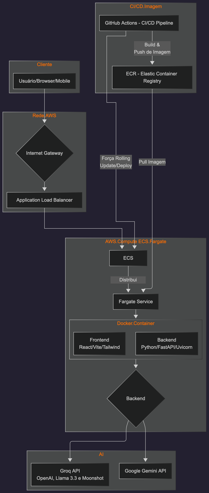
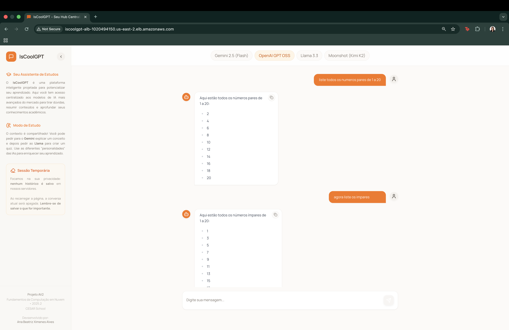
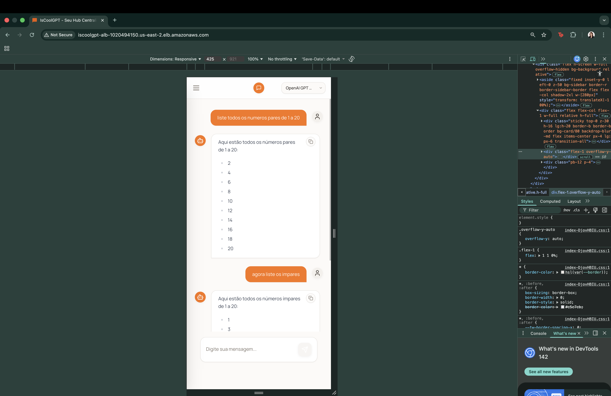
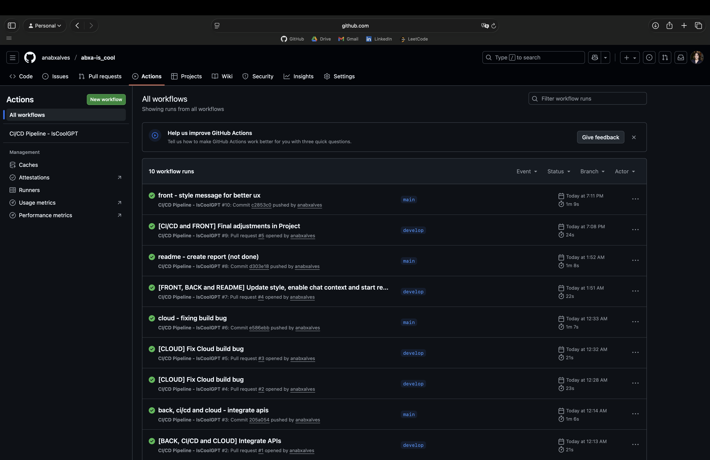

# ☁️ IsCoolGPT - Assistente de Estudos Inteligente Cloud Native

**Projeto AV2:** Fundamentos de Computação em Nuvem (2025.2)

**Aluna:** Ana Beatriz Ximenes Alves

**Link de acesso:** [IsCoolGPT - eu Hub Centralizado de IAs](http://iscoolgpt-alb-1020494150.us-east-2.elb.amazonaws.com)
> **ATENÇÃO**: Caso o link de acesso não funcione como esperado, verifique o protocolo http associado. O correto é o `http`, tendo em vista que este projeto é puramente acadêmico, não armazena dados sensíveis e não .
---

## 📑 Sumário
1. [Visão Geral do Projeto](#-visão-geral-do-projeto)
2. [Arquitetura da Solução](#-arquitetura-da-solução)
3. [Jornada de Desenvolvimento](#-jornada-de-desenvolvimento)
4. [Justificativas Técnicas (Design Choices)](#-justificativas-técnicas-design-choices)
5. [Guia de Execução Local](#-guia-de-execução-local)
6. [Pipeline de CI/CD e Automação](#-pipeline-de-cicd-e-automação)
7. [Evidências de Funcionamento](#-evidências-de-funcionamento)

---

## 🎯 Visão Geral do Projeto

O **IsCoolGPT** é uma aplicação *Fullstack* projetada para democratizar o acesso a múltiplos modelos de Inteligência Artificial (LLMs) para estudantes. A aplicação centraliza o acesso a modelos como **Gemini (Google)**, **Llama 3.3(70b Versatile)**, **OpenAI (GPT OSS 20b)"** e **Moonshot Kimi K2 (via Groq)"** em uma interface única, moderna e responsiva.

O diferencial deste projeto não é apenas a aplicação em si, mas a **Infraestrutura em Nuvem (AWS)** e a **Engenharia de Software (DevOps)** utilizadas para sustentá-la, focando em escalabilidade, segurança e entrega contínua. Além disso, o sistema mantém o **contexto da conversa**, permitindo que o aluno faça perguntas sequenciais e a IA entenda a referência, simulando uma memória de curto prazo sem a necessidade de banco de dados complexo.

---

## 🏗️ Arquitetura da Solução

A solução foi arquitetada seguindo os princípios do *Twelve-Factor App*, utilizando contêineres para garantir portabilidade e serviços gerenciados da AWS para garantir disponibilidade.

### Diagrama de Infraestrutura
A arquitetura do IsCoolGPT é desenhada para ser cloud-native e utilizar recursos serverless da AWS, maximizando a escalabilidade e a abordagem stateless. Dessa forma, o fluxo de dados do usuário até o backend, e o fluxo de CI/CD, são detalhados abaixo:
- A arquitetura utiliza o Application Load Balancer (ALB) para ingressar o tráfego e distribuí-lo para o ECS Cluster. 
- O serviço é executado no modo Fargate, que gerencia a execução de tarefas (Tasks). Cada Task executa um Container Docker Único que serve tanto o frontend estático (compilado via Node.js) quanto o backend (FastAPI/Python). 
- As credenciais de API (GEMINI_API_KEY, GROQ_API_KEY) são injetadas de forma segura na Task Definition via variáveis de ambiente. 
- O processo de automação (CI/CD) é gerenciado pelo GitHub Actions, que é responsável por construir a imagem, fazer o push para o ECR (Elastic Container Registry), e forçar o rolling update no ECS.

> *O diagrama abaixo ilustra o fluxo da requisição desde o cliente até o processamento no ECS Fargate.*



> #### Fluxo de Execução:
> 1. O Usuário acessa a plataforma via Browser/Mobile. O tráfego passa, implicitamente, pelo Internet Gateway (necessário para acesso público).
> 2. O tráfego é roteado para o Application Load Balancer (ALB) na Porta 80.
> 3. O ALB distribui a requisição para o ECS Cluster.
> 4. O ECS Fargate gerencia e executa uma Task.
> 5. A Task executa o container Docker Único (Frontend + Backend FastAPI).
> 6. O Backend (FastAPI) se comunica externamente com as APIs de IA (Google Gemini e Groq).
> 
> 


### Componentes Chave:
* **Frontend:** React + Vite + TailwindCSS (Interface otimizada e responsiva).
* **Backend:** Python FastAPI (Alta performance assíncrona).
* **Container Registry (ECR):** Repositório privado e seguro para as imagens Docker versionadas.
* **Orquestração (ECS Fargate):** Gerenciamento de containers *Serverless*, eliminando a necessidade de gerenciar instâncias EC2 manualmente.
* **Traffic Management (ALB):** Application Load Balancer para distribuir tráfego e fornecer um ponto de entrada (DNS) fixo e estável.

---
## 📈Fluxo de Dados

O IsCoolGPT adota uma arquitetura de backend totalmente *stateless* (sem estado), onde o histórico da conversa é gerenciado exclusivamente pelo cliente. Vejamos que isso é fundamental para a escalabilidade infinita em ambiente serverless.


### Ciclo de Vida de uma Mensagem
O ciclo de vida da mensagem, destacando a passagem do contexto, ocorre conforme os passos abaixo:
1. Geração do Conteúdo e Contexto (Frontend):
> O usuário digita uma mensagem (por exemplo, "Olá, explique nuvem") no Frontend, que é responsável por gerenciar o histórico da conversa.

2. Preparação da Requisição: 
> O Frontend empacota a nova mensagem do usuário junto com todo o histórico de mensagens anterior (o contexto), e essa requisição é enviada para o Backend (FastAPI).

3. Entrada na AWS:
> A requisição viaja pela rede, entrando pelo Application Load Balancer (ALB) público, que a encaminha para o Target Group do ECS Fargate.

4. Processamento pelo Backend: 
> Uma Task do Fargate, que executa o container Docker único com o Backend FastAPI, recebe a requisição, momento em que o Backend utiliza o Pydantic para estruturar os dados, recebendo a mensagem atual e o contexto completo.

5. Inferência de IA:
> O Backend utiliza o contexto recebido para formular uma requisição coerente para as IAs integradas, cujas chaves de API necessárias são injetadas de forma segura via variáveis de ambiente na Task Definition.

6. Retorno da Resposta:
> A API de IA externa retorna a resposta de inferência para o Backend FastAPI.

7. Transmissão de Volta:
> O Backend envia a resposta ao cliente (Frontend).

8. Renderização (Frontend):
> O Frontend recebe a resposta e a renderiza utilizando React Markdown, aplicando syntax highlighting para melhor visualização. Nesse momento, o Frontend atualiza seu estado, incorporando esta nova interação ao histórico que será enviado na próxima requisição.

### 📈 Benefício da Arquitetura Stateless
O principal benefício dessa abordagem é a escalabilidade infinita em ambiente serverless. Como o backend não precisa armazenar, recuperar ou manter o estado da sessão em memória ou em um banco de dados persistente, qualquer Task do Fargate pode processar qualquer requisição a qualquer momento. 

Vejamos que isso elimina a necessidade de ***sticky sessions*** e permite que o Application Load Balancer distribua a carga de forma eficiente para um número ilimitado de tarefas, garantindo que o IsCoolGPT possa lidar com picos de tráfego de estudantes sem degradação de performance.

---

## 🛠️ Jornada de Desenvolvimento

O projeto foi construído em 4 fases distintas, evoluindo de um ambiente local para uma infraestrutura de produção na nuvem.

### Fase 1: Desenvolvimento da Aplicação (Local)
* Criação do Frontend com React e integração inicial via Mock.
* Desenvolvimento do Backend em FastAPI.
> * **Desafio:** Conectar Frontend e Backend lidando com CORS.
> * **Solução:** Implementação de Proxy no Vite e configuração de CORS no FastAPI.

### Fase 2: Containerização Otimizada
* Criação do `Dockerfile`.
* **Estratégia:** Adoção de *Multi-Stage Build*.
    * *Estágio 1 (Node.js):* Compila o React e gera os arquivos estáticos (HTML/CSS/JS).
    * *Estágio 2 (Python):* Instala apenas o runtime do Python e copia os arquivos estáticos do estágio 1.
* **Resultado:** Uma imagem final leve, contendo apenas o necessário para rodar, sem código fonte de desenvolvimento.

### Fase 3: Provisionamento de Infraestrutura (AWS)
* Criação de Roles IAM seguindo o princípio do **Menor Privilégio** (Acesso apenas ao ECR e CloudWatch).
* Configuração do Cluster ECS Fargate.
* Implementação do Application Load Balancer (ALB) e Target Groups para garantir acesso público estável, contornando a troca de IPs dinâmicos do Fargate.

### Fase 4: Automação DevOps (CI/CD)
* Configuração do GitHub Actions.
* Implementação de pipeline que testa o código, constrói a imagem, envia para o ECR e força a atualização do serviço no ECS automaticamente a cada *push* na branch `main`.

---

## 💡 Justificativas Técnicas (Design Choices)

Nesta seção, detalho o porquê de cada escolha técnica para atender aos requisitos de avaliação.

| Decisão | Justificativa / Benefício |
| :--- | :--- |
| **AWS Fargate** | **Requisito: Escalabilidade e Gestão.** <br/>O modelo *Serverless* remove a carga operacional de gerenciar/atualizar SO de servidores EC2, permitindo focar na aplicação. |
| **Single Container** | **Requisito: Eficiência.** <br/>Servir o Frontend estático através do Backend Python elimina a necessidade de dois containers separados ou baldes S3 complexos, simplificando o deploy e eliminando problemas de CORS em produção. |
| **Load Balancer (ALB)** | **Requisito: Disponibilidade.** <br/>O Fargate altera o IP da tarefa a cada deploy. O ALB fornece um DNS fixo e realiza *Health Checks*, garantindo que o usuário nunca seja direcionado para um container quebrado. |
| **GitHub Actions** | **Requisito: Automação.** <br/>Elimina o erro humano no processo de deploy. O pipeline garante que apenas código testado chegue à produção. |
| **Multi-Stage Build** | **Requisito: Performance.** <br/>Reduz drasticamente o tamanho da imagem final e aumenta a segurança ao não incluir ferramentas de build (como npm e gcc) no ambiente de produção. |

---

## 💻 Guia de Execução Local

Para rodar o projeto na sua máquina para desenvolvimento ou testes.

### Pré-requisitos
* Docker instalado.
* Chaves de API (Gemini/Google e Groq).

### 1. Configuração de Segredos (.env)
Crie um arquivo `.env` na raiz do projeto:
```env
# Chaves de API (Obtenha no Google AI Studio e Groq Console)
GEMINI_API_KEY={sua_chave_aqui}
GROQ_API_KEY={sua_chave_aqui}
```

### 2. Rodar com Docker (Recomendado)
 ```bash
    # 1. Construir a imagem
    docker build -t abxa-iscoolgpt-local .
    
    # 2. Rodar o container
    docker run -p 8080:80 --env-file .env abxa-iscoolgpt-local
```
Acesse: http://localhost:8080

---

## 🚀 Pipeline de CI/CD e Automação
O projeto conta com um pipeline robusto definido em `.github/workflows/deploy.yml`:
- CI (Integração): Roda testes automatizados (pytest) a cada Pull Request na branch `main` para validar integridade do código e presença de chaves.
- CD (Entrega): No merge para a main, constrói a imagem Docker, envia para o ECR e força o Rolling Update no ECS.

---

## 📸 Evidências de Funcionamento
1. Aplicação com Memória (Contexto) e Design Responsivo




2. Pipeline DevOps (Github Actions)



3. Infraestrutura AWS

Devido às práticas de privacidade do projeto, as capturas de tela do ambiente Amazon AWS são privadas. Sinta-se à vontade para solicitar acesso!

> [Capturas de Tela AWS Console](https://drive.google.com/file/d/1iCja4sYXYw2EXMH0f1U1yfoUc5eLp1YP/view?usp=share_link)

---

## 🔮 Próximos Passos e Roadmap de Evolução

Este projeto representa um MVP (Minimum Viable Product) funcional e resiliente, porém, para transformá-lo em uma plataforma SaaS (Software as a Service) de larga escala, o seguinte roadmap técnico foi desenhado:

### 1. Funcionalidades e Experiência do Usuário
* [ ] **Persistência de Dados (Histórico):**
    * **Problema:** Atualmente, o histórico vive na sessão do navegador (Stateless).
    * **Solução:** Implementar **Amazon DynamoDB** (NoSQL) para armazenar logs de conversas, tendo em vista que o DynamoDB oferece baixa latência e integração nativa serverless, ideal para armazenar JSON de mensagens.
* [ ] **Autenticação e Segurança:**
    * **Problema:** Acesso aberto a qualquer pessoa com o link.
    * **Solução:** Integrar **AWS Cognito** para gerenciar usuários (Sign-up/Sign-in) e proteger as rotas da API, garantindo que cada aluno acesse apenas seus próprios históricos.
* [ ] **Upload de Documentos (RAG - Retrieval-Augmented Generation):**
    * **Melhoria:** Permitir que o aluno faça upload de PDFs (ex: slides da aula) e a IA responda com base neles.
    * **Tech:** Usar **LangChain** + **Vector Database** para indexar o conteúdo das aulas.

### 2. Arquitetura para Alta Escalabilidade (Scale-Up)
Caso o projeto cresça para milhares de alunos simultâneos, a arquitetura atual deve evoluir para:

* [ ] **Cache Inteligente (Redis/ElastiCache):**
    * Implementar uma camada de cache para armazenar respostas de perguntas frequentes (ex: "O que é S3?"), reduzindo custos com APIs de IA e latência para o usuário.
* [ ] **Processamento Assíncrono (SQS + Lambda):**
    * Para modelos de IA mais lentos ou processamento de arquivos pesados, substituir a chamada HTTP direta (síncrona) por uma arquitetura de eventos:
    * *API Gateway -> SQS (Fila) -> Lambda (Processa IA) -> WebSocket (Notifica Frontend).*
* [ ] **CDN (CloudFront):**
    * Colocar o **Amazon CloudFront** na frente do Load Balancer para cachear os arquivos estáticos do React (JS/CSS) em borda (Edge Locations), reduzindo a carga no container e acelerando o carregamento global.

### 3. FinOps e Observabilidade
* [ ] **Rastreamento Distribuído (AWS X-Ray):**
    * Implementar X-Ray para visualizar gargalos de performance entre o Backend e as APIs externas (Groq/Google).
* [ ] **Alertas de Custo (AWS Budgets):**
    * Configurar alarmes para evitar surpresas na fatura, especialmente se o Auto Scaling escalar o cluster excessivamente.